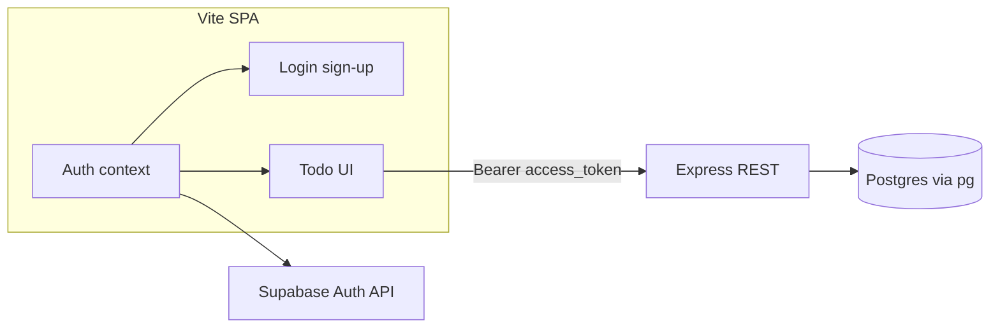

# Supabase auth, Express + pg API, and todo UI

## Current state

- **Stack**: Vite + React 19 ([`package.json`](package.json)); no router.
- **Supabase client**: [`src/utils/supabase.ts`](src/utils/supabase.ts) uses `VITE_SUPABASE_URL` and `VITE_SUPABASE_PUBLISHABLE_KEY` for **Auth only** in this architecture.
- **App**: Default Vite template in [`src/App.tsx`](src/App.tsx); no auth or todo UI yet.
- **Database**: Assume **`public.todos` already exists** in the Supabase project. Implementation will **inspect** actual columns (Table Editor or `information_schema`) and map REST payloads/queries accordingly (typical fields: `id`, `user_id`, `title`, `completed`, `created_at` — adjust if your table differs).
- **Note**: [`.env`](.env) may contain secrets; ensure `.env` is gitignored and provide `.env.example` without real values.

## 1. Supabase project configuration (Dashboard)

Same as before for **Authentication** (Email provider, Site URL `http://localhost:5173`, redirect URLs).

**API keys**: Keep `VITE_SUPABASE_*` for the browser client.

**Server-only secrets** (never expose to Vite):

- **`DATABASE_URL`**: Postgres connection string from **Settings → Database** (use **Session mode** pooler or direct host as recommended for server apps; avoid exposing the **service_role** key to the client — here we use the DB connection string, not the anon key, for `pg`).
- **`SUPABASE_JWT_SECRET`** (or verify JWT via project JWKS): Used by Express to validate `Authorization: Bearer <access_token>` from the logged-in user and read the **`sub` claim** as `user_id` for scoping queries.

## 2. Existing `todos` table — no greenfield DDL

- **Do not** create a new table as part of this plan unless you discover gaps.
- **Before coding**: Confirm column names and types for `public.todos` (especially how **ownership** is stored — almost always `user_id` referencing `auth.users`).
- **RLS and server-side `pg`**: Supabase direct connections often use a role that **bypasses RLS**. Treat **authorization as enforced in Express**: every query must include `WHERE user_id = $verifiedSub` (parameterized). Optionally review RLS policies for defense in depth if you later use a role that does not bypass RLS.

## 3. Architecture

- **SPA**: `supabase.auth` for session, sign-in, sign-up, sign-out. Todo operations use `fetch` (or axios) to **`/api/todos`** with `Authorization: Bearer ${session.access_token}`.
- **Express**: Validates JWT, extracts `sub`, uses **`pg` `Pool`** for parameterized SQL CRUD on `todos` filtered by `user_id = sub`.
- **CORS**: Allow the Vite dev origin (`http://localhost:5173`). For production, set allowed origins explicitly.

## 4. Express REST API (shape)

| Method           | Path             | Behavior                                                     |
| ---------------- | ---------------- | ------------------------------------------------------------ |
| `GET`            | `/api/todos`     | List todos for `sub`                                         |
| `POST`           | `/api/todos`     | Create row with `user_id = sub` + body fields (e.g. `title`) |
| `PATCH` or `PUT` | `/api/todos/:id` | Update allowed fields if row belongs to `sub`                |
| `DELETE`         | `/api/todos/:id` | Delete if row belongs to `sub`                               |

Use **404** or **403** when `id` does not exist or is not owned by `sub` (pick one consistent policy).

**Packages** (server): `express`, `pg`, `cors`, plus a JWT verifier (`jose` or `jsonwebtoken` with Supabase JWT secret). Types: `@types/express`, `@types/pg`, etc., if using TypeScript.

**Layout options**: `server/index.ts` at repo root with `tsx`/`ts-node`, or a small `server/` package with its own `package.json`. **Dev**: run Express on e.g. port `3000` and Vite on `5173`; use [`vite.config.ts` `server.proxy`](https://vite.dev/config/server-options.html#server-proxy) for `/api` → `http://localhost:3000` so the SPA can call relative `/api/todos` without CORS friction, **or** set `VITE_API_URL` and configure CORS.

## 5. React app (auth + todo UI)

- **Session**: `getSession` + `onAuthStateChange` as before.
- **Todos**: No `supabase.from('todos')` — replace with API client helpers that attach the Supabase **access token** (refresh or re-fetch session if needed before write operations).
- **Files**: [`src/App.tsx`](src/App.tsx) shell; components for login and todo list; keep [`src/utils/supabase.ts`](src/utils/supabase.ts) for auth client only.

## 6. Verification

- Start API and Vite (document `npm` scripts, e.g. `concurrently` or two terminals).
- Sign in, exercise list/create/update/delete, sign out and confirm API returns 401 without token.
- `npm run build` for the client; ensure server starts in CI only if you add a check (optional).

## Summary

| Layer    | Deliverable                                                                            |
| -------- | -------------------------------------------------------------------------------------- |
| Supabase | Auth settings + existing `todos` schema understood; JWT secret + DB URL on server only |
| Express  | REST CRUD with `pg`, JWT middleware, user-scoped queries                               |
| Vite app | Email auth + todo UI talking to `/api` with Bearer token                               |
